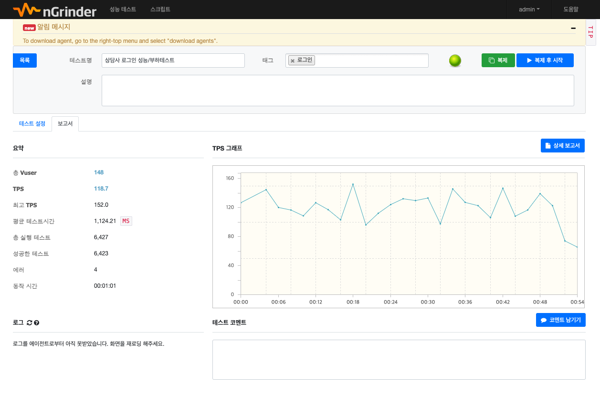

# 성능/부하 테스트
## 1. 진행방법
- 환경 : 개발서버 (타 운영서비스에 영향을 주지않도록 개발서버 및 개발DB 환경에서 진행)
- Tool : ngrinder (Naver 성능/부하테스트 툴)
- 시간 : 1분
- 가상 사용자(Vuser) : 148명 (process 4 X thread 37)
- 방식 : 가상의 사용자를 설정하여 일정시간동안 반복적으로 요청하고 그에대한 응답 상태를 확인
- 주요 수치 : TPS (Transaction Per Second) 초당 처리 횟수

## 2. 테스트 케이스
### (1) 회사 목록 조회
- 기능 : 상담톡 첫화면 접근시 호출되는 API로 회사정보를 조회한다.
- URL : https://cstalk-dev.gasapp.co.kr/api/company

- 결과 : 1분동안 약 9,800번의 요청을 진행하고 에러 없이 모두 성공함.
- TPS : 최대 364.5, 평균 181.3

### (2) 상담사 로그인
- 기능 : 상담사가 입력한 직원정보를 이용하여 로그인 처리한다. (중계서버 연동)
- URL : https://cstalk-dev.gasapp.co.kr/auth/login

- 결과 : 1분동안 약 6,427번의 요청을 진행하고 4건의 에러발생.
- TPS : 최대 152.0, 평균 118.7

### (3) Today (상담사별 오늘의 상담현황)
- 기능 : 로그인한 상담사의 상담현황을 조회한다. (집계성)
- URL : https://cstalk-dev.gasapp.co.kr/api/stats/myToday

- 결과 : 1분동안 약 9,620번의 요청을 진행하고 에러 없이 모두 성공함.
- TPS : 최대 287.5, 평균 177.8

## 3. 결론
- 상담톡 서비스는 초당 118건의 처리량을 처리할 수 있음.
- 약 150명의 동시접속을 허용할 수 있는 시스템으로 판단 됨.

[< 목록으로 돌아가기](manual.md)